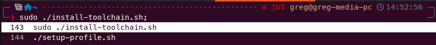
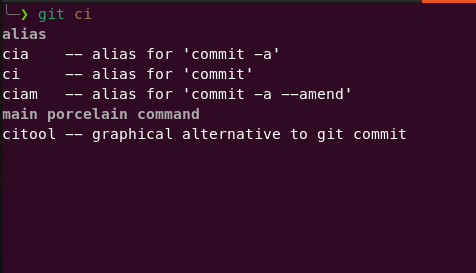
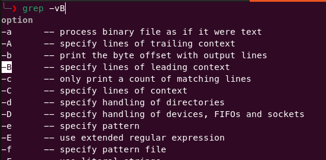
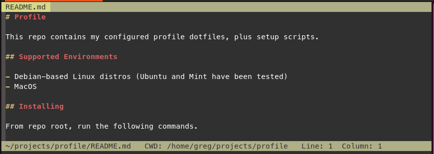

# Profile

This repo contains my configured profile dotfiles, plus setup scripts.

Example prompt with reverse history search:



Argument completions, both subcommands and flags:




Vim style:



## Supported Environments

- Debian-based Linux distros (Ubuntu and Mint have been tested)
- MacOS

## Installing

From repo root, run the following commands.

On Linux:

```sh
sudo ./install-toolchain.sh
./setup-profile.sh
```

On Mac:

```sh
./install-toolchain.sh
./setup-profile.sh
```

Note that the installed `.ssh/config` file will need to be customized or
omitted if you're not me, since it includes references to my publickey files.

## Configured Tools

### Toolchains

- Go: installs and adds to path

### Shell

- Installs and `chsh` to Zsh
- Uses [Oh my zsh](https://ohmyz.sh/)
- Sets the theme to [Powerlevel10k](https://github.com/romkatv/powerlevel10k)
- Installs a [Nerd Font](https://github.com/ryanoasis/nerd-fonts) to show the nifty
  symbols used by P10k

### Configs

- **Git** config with commonly-used aliases, including helpers in `~/scripts`
- **Vim** config and a small number of plugins
- **SSH** config, see [doc](docs/ssh.md)

## Why These Choices?

See [Why Not X?](docs/why-not.md)
